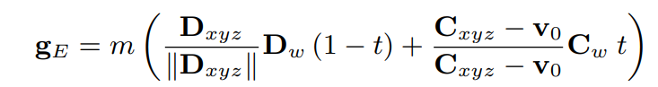
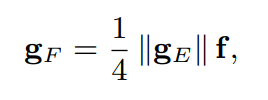
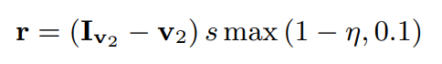
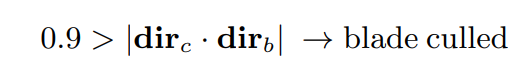
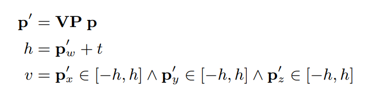
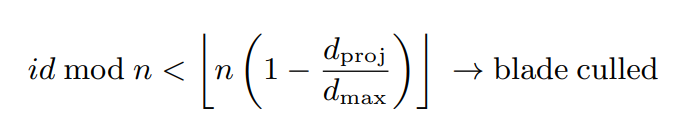
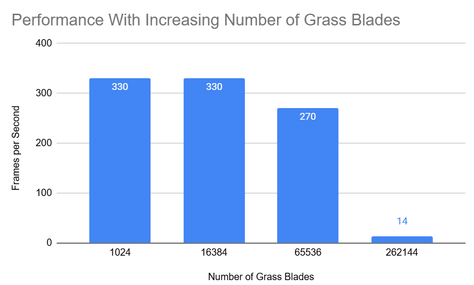
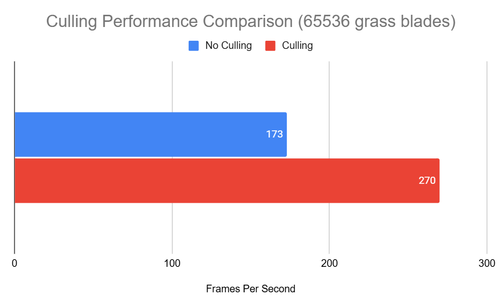

Vulkan Grass Rendering
==================================

**University of Pennsylvania, CIS 565: GPU Programming and Architecture, Project 5**

* Harris Kokkinakos
  * [LinkedIn](https://www.linkedin.com/in/haralambos-kokkinakos-5311a3210/), [personal website](https://harriskoko.github.io/Harris-Projects/)
* Tested on: Windows 24H2, i9-12900H @ 2.50GHz 16GB, RTX 3070TI Mobile

### Description
This project implements a Vulkan-based version of Responsive Real-Time Grass Rendering, adapted from Jahrmann & Wimmer (2017).
The goal of this project is to produce a satisfying and physically accurate representation of grass.
A compute pass performs physics evaluation and culling, while the tessellation pipeline generates detailed curved blades using control points derived from a quadratic Bézier model.

RESULTS
================

IMPLEMENTATION
================

### Grass Representation
Each blade is defined by three control points v0, v1, v2 forming a quadratic Bézier curve. Additionally, each blade has attributes including height, width, stiffness, up vector, and orientation.
* v0 = root fixed to terrain
* v2 = tip affected by forces
* v1 = intermediate control derived from v0,v2

### Physics
For each frame, the compute shader updates all blades in parallel. It computes gravity, recovery, and wind forces and applies them to each grass blade.

We seperate gravity into two terms, environmental (gE) and front (gF). 

gE is the environmental gravity vector applied uniformly to all blades.
It represents the constant downward pull of gravity on the tip of each blade, modeled as:

gF is the front-facing gravity component, added to tilt the blade slightly in the direction it’s facing, producing a more natural lean instead of purely vertical bending.

These two forces are added together to get the total gravity force.

The recovery force restores each blade tip back toward its rest position. This counteracts bending caused by gravity and wind. It is like a spring damping force. It is modeled as:

The wind force introduces dynamic, time-dependent bending to simulate airflow across the grass field.
Instead of using precomputed flow fields like in the paper, this implementation defines wind procedurally using trigonometric variation over both time and position, giving a natural wave motion that travels across the scene.

All contributions sum into a total force F = G + R + W, updating v2 with time-step Δt.
The algorithm enforces length preservation and clamps vertical penetration, mirroring section 5.2 of the paper’s responsive model

### Culling
To maintain real-time performance, grass blades are culled directly on the GPU before rendering.
Each compute shader invocation decides whether a blade should be drawn based on its orientation, visibility, and distance relative to the camera.
Blades that pass all culling tests are written into a culled buffer and counted atomically for indirect drawing.

Orientation culling removes blades that are almost parallel to the camera’s view direction (in this case, within 10%).
When a blade is seen nearly from the side, its thin geometry contributes little visually but adds unnecessary tessellation cost.

The algorithm computes the dot product between the camera forward vector and the blade’s front direction:

Frustum culling discards blades outside the camera’s visible volume.
Each blade’s base (v0), tip (v2), and midpoint (m) are transformed into clip space:

If all three points lie outside the frustum, the blade is culled.
This ensures that only blades potentially visible in the camera’s view are sent to tessellation and rasterization.

Distance culling removes blades too far from the camera (in this case, more than 25 units away).
It computes the projected horizontal distance from the blade’s root (v0) to the camera position (camPos):

If a grass blade passes all three of these tests, it can be rendered. 

### Performance

This Vulkan Grass Renderer was tested at varying numbers of grass blades as shown below.

As we from this chart, the performance of this renderer is able to produce high frame rates even through extremely high numbers of grass blades to simulate. The extreme fall off of performance is because it is tested on exponentially increasing numbers of grass blades. 

Additionally, we can calculate the performance increase due to the culling optimizations. 

As this chart shows, at 65536 grass blades, there is almost a 100FPS improvement using the three culling methods implemented. This equates to over a 50% speedup for the renderer, proving culling to be a substantial improvement. This test primarily focuses on frustum and orientation culling as the distance culling was not utilized since the camera was close to the grass. Distance culling adds even further improvement to games and rendering when we do not want to render grass that is far away from the camera/player.

